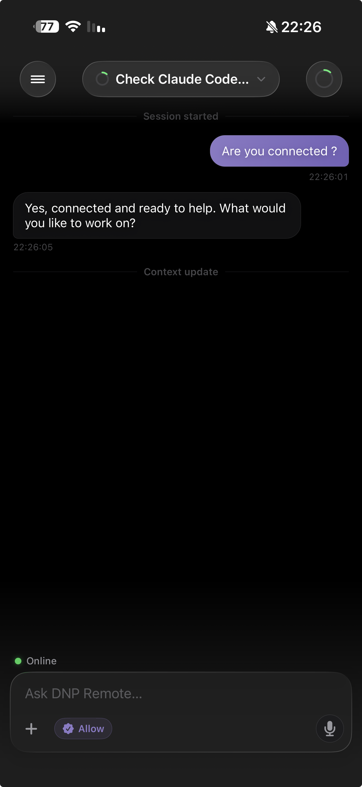
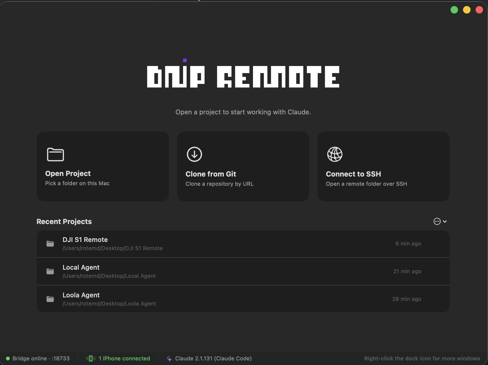
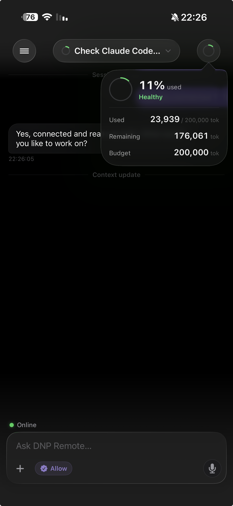
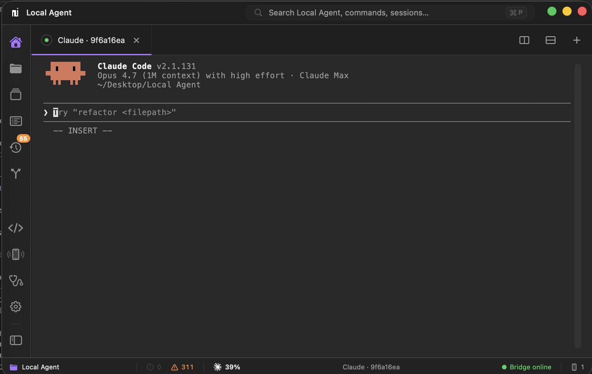

<h1 align="center">DNP Remote IDE</h1>

<p align="center">
  A native macOS IDE that hosts Claude Code in a real PTY, surfaces every
  command, file edit, tool call and approval as a clean stream of
  <em>semantic events</em>, and lets you supervise a session from a paired
  iPhone over a signed local WebSocket bridge.
</p>

<p align="center">
  <a href="https://github.com/rotem221/DNPRemoteIDE/releases/latest"></a>
  <a href="https://github.com/rotem221/DNPRemoteIDE/releases"></a>
  <a href="LICENSE"></a>
  <a href="https://github.com/rotem221/DNPRemoteIDE/actions/workflows/release.yml"></a>
</p>

---

## Download

<table>
<tr>
<th width="50%" align="center">📱 &nbsp;DNP Remote IDE — iPhone</th>
<th width="50%" align="center">💻 &nbsp;DNP Remote Mac — desktop IDE</th>
</tr>
<tr>
<td align="center">

_App Store link coming soon_<br/>
<sub>The iPhone companion mirrors your Mac sessions, surfaces approvals as Liquid&#8209;Glass cards, and lets you talk to Claude from anywhere on your LAN or tailnet.</sub>

</td>
<td align="center">

<a href="https://github.com/rotem221/DNPRemoteIDE/releases/latest"><strong>⬇️ &nbsp;Download latest DMG</strong></a><br/>
<sub>Universal binary, signed with a Developer ID, notarized by Apple. Auto&#8209;updates via Sparkle on a 24h cadence and on demand from <em>Settings → Updates → Check Now</em>.</sub>

</td>
</tr>
<tr>
<td></td>
<td></td>
</tr>
<tr>
<td></td>
<td></td>
</tr>
</table>

> **iPhone (top → bottom):** the chat surface paired to the Mac (top
> bar shows the active session capsule, status pill says *Online*),
> and the same chat with the context-monitor popover open — 11% used
> against the 200K window, with a Healthy badge. *Approvals*, when
> Claude needs permission, appear as a card above the composer; the
> *Allow* pill on the input row is the always-visible force-approve
> shortcut for users who'd rather decide quickly.
>
> **Mac (top → bottom):** the welcome scene first thing on launch —
> three entry tiles for opening a local folder, cloning a Git URL, or
> connecting to an SSH host, plus a Recent Projects strip. Then the
> workspace itself — one window per project, terminal pane in the
> centre running `claude` inside a real PTY, sidebar covering
> sessions / files / GitHub / screen-mirror / settings / diagnostics,
> bridge status pinned to the bottom-right.

---

## What is this

**DNP Remote IDE** is a macOS-native developer environment built around
[Claude Code](https://docs.claude.com/en/docs/claude-code/overview).
It is *not* a wrapper around `Process` — every Claude session runs in a
real terminal (PTY), with full ANSI colour, raw mode, resize, and signal
forwarding. On top of that real terminal it adds:

- **Semantic event feed** — commands, file edits, tool calls, and
  Claude’s internal lifecycle messages are extracted and displayed as
  structured cards alongside the terminal pane.
- **Approval flow** — every Claude permission prompt routes through an
  in-app card (and, optionally, a paired iPhone) before reaching the
  actual `claude` process. No `--dangerously-skip-permissions` mode.
- **Multi-pane, multi-window IDE** — split panes (up to 4 per window),
  one window per project, in-app file explorer + code viewer + GitHub
  pane. Keyboard-shortcut driven.
- **Pairable iPhone companion** — mobile remote built on a signed local
  WebSocket bridge. The iPhone never executes shell — it only displays
  semantic events and replies to approvals. *(The iPhone app is
  distributed separately via the App Store; this repo contains only
  the Mac IDE.)*
- **Local-first storage** — every session’s transcript, JSONL events
  and metadata are persisted under your local `memory/` directory, with
  a project-level `MEMORY.md` notebook auto-maintained per repo.
- **Background auto-updates** — Sparkle-signed Ed25519 release updates
  delivered via this repo’s GitHub Releases.

## Download

### Pre-built app (recommended)

1. Open the [latest release](https://github.com/rotem221/DNPRemoteIDE/releases/latest).
2. Download the `.dmg` matching your Mac:
   - **`DNPRemoteMac-x.y.z-arm64.dmg`** for Apple Silicon (M-series) Macs.
   - **`DNPRemoteMac-x.y.z-x86_64.dmg`** for Intel Macs.
3. Open the DMG. A window appears showing **DNP Remote Mac.app** next to
   an `Applications` shortcut.
4. **Drag DNP Remote Mac.app onto Applications.**
5. Eject the disk image, open *Applications → DNP Remote Mac*.

The app is signed with a *Developer ID* certificate and notarized by
Apple, so Gatekeeper opens it without any "unidentified developer"
prompts.

Updates land automatically in the background once a day, or on demand
from **Settings → Updates → Check Now** (and from
**DNP Remote Mac → Check for Updates…** in the menu bar).

### From source

```sh
git clone https://github.com/rotem221/DNPRemoteIDE.git
cd DNPRemoteIDE
./scripts/bootstrap.sh
open apps/DNPRemoteMac/DNPRemoteMac.xcodeproj
```

The bootstrap script:

- Installs `xcodegen` via Homebrew if missing.
- Builds the `dnp-hook-relay` Swift CLI (used by Claude Code hooks).
- Resolves the shared Swift package dependencies.
- Generates `apps/DNPRemoteMac/DNPRemoteMac.xcodeproj` from
  `apps/DNPRemoteMac/project.yml`.
- Seeds `apps/DNPRemoteMac/Local.xcconfig` from the sample template
  (gitignored — edit it to put your own Apple `DEVELOPMENT_TEAM` ID
  in place so signed local builds work).

Then ⌘R from Xcode.

## Requirements

| Requirement              | Why                                                                  |
| ------------------------ | -------------------------------------------------------------------- |
| **macOS 14+**            | App deployment target. Sparkle, SwiftUI, AVFoundation features used. |
| **Claude Code CLI**      | The IDE launches and supervises `claude`. [Install guide](https://docs.claude.com/en/docs/claude-code/overview). |
| **Xcode 16+** *(source)* | To open the generated project. Xcode-cli alone is not enough.        |
| **Apple Developer ID** *(source, signing)* | To run a signed local build. Free Apple ID is also fine for unsigned local Debug builds. |

## Architecture (one-paragraph)

Three layers. The **PTY runtime** (`Terminal/`) drives a real `forkpty`
child running `claude`, with proper termios raw mode and `TIOCSWINSZ`
resize. The **event normalizer** (`Terminal/EventNormalizerService.swift`)
strips ANSI, applies a noise filter, and runs a chain of detectors
(commands, code edits, tool calls, lifecycle, approval prompts) that
emit `SessionEvent` records consumed by both the event feed pane and
the iPhone bridge. The **bridge server**
(`Bridge/BridgeServerService.swift`) hosts a length-prefixed signed
WebSocket on the local network, with Ed25519 device keys bootstrapped
via QR pairing and stored in the system Keychain.

For deeper dives:

- [`docs/ARCHITECTURE.md`](docs/ARCHITECTURE.md) — system map and data flow.
- [`docs/PROTOCOL.md`](docs/PROTOCOL.md) — bridge envelope format.
- [`docs/SECURITY.md`](docs/SECURITY.md) — pairing, signing, threat model.
- [`docs/CLAUDE_CODE_INTEGRATION.md`](docs/CLAUDE_CODE_INTEGRATION.md) — hooks, settings, permissions.
- [`docs/UPDATES.md`](docs/UPDATES.md) — release pipeline and Sparkle keys.

## Repository layout

```
DNPRemoteIDE/
├── apps/DNPRemoteMac/         macOS Xcode project (XcodeGen)
├── Packages/DNPShared/        Models, protocol, security primitives
├── tools/dnp-hook-relay/      Swift CLI invoked by Claude Code hooks
├── tools/dnp-event-normalizer Standalone normalizer (offline replay)
├── tools/dnp-session-exporter Markdown / JSON export of a session
├── docs/                      Architecture, protocol, security, etc.
├── scripts/                   bootstrap, doctor, release, Sparkle
└── .github/workflows/         CI: build, sign, notarize, publish DMG
```

## Releasing (maintainers)

Read [`docs/UPDATES.md`](docs/UPDATES.md) before the first release —
it covers Sparkle keypair generation, GitHub repository secrets, and
the manual `Release` workflow. Once configured:

1. Push the change to `main`.
2. **Actions → Release → Run workflow → version `X.Y.Z`**.
3. Wait ~25 minutes. The workflow notarizes both arch shards, signs the
   appcast with the Sparkle Ed25519 key, publishes a GitHub Release,
   and pushes per-arch appcasts to `releases/latest/download/...` so
   shipped apps pick up the update on their next 24h probe.

## Status

This project is in active development. The current release line is
`0.1.x` — pre-1.0, breaking changes possible. See
[`docs/CHANGELOG.md`](docs/CHANGELOG.md) for what changed.

## License

[MIT](LICENSE) — © 2026 Rotem Dadon. Use it, fork it, improve it.
Pull requests welcome.
